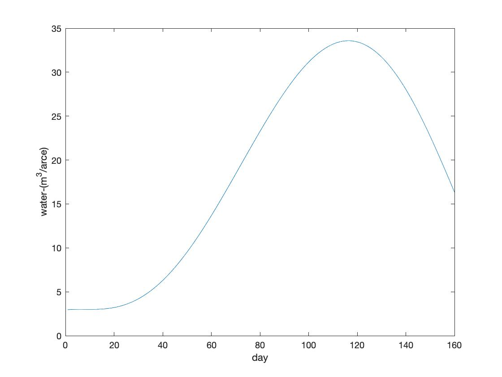

# PlantCare

## Introduction
PlantCare is your best assistant in water conservation!

### Summary

PlantCare is a website that provides professional agricultural advice for farmers in order to improve sustainable farming. At this stage, PlantCare provides farmers with accurate amount of water needed for irrigation in the next day. It combines scientific planting plans designed by agriculture experts as well as accurate weather prediction. For future plans, we will also add features including fertilization advice, which is influenced by weather, brands of fertilizer and soil condition. 

### Features

PlantCare obtains your current location as well as weather prediction of the next day. Based on the temperature, precipitation and air pressure, PlantCare calculates the evaporation capacity accurately. Taking into consideration of the age of your crop and the watering it needs at this stage, PlantCare offers you the amount of water needed for irrigation in millimeters. 

#### Future Plan

With support of experts, we will provide more comprehensive suggetions for agriculture like fertilizer amount.

What's more, since argriculture product price is mainly affected by supply and demand relation, if the web is wildly used by farmers, we can get the estimate of crop price.

## Requirements

django == 1.10.5

### Contact

Please contact our teammembers through GitHub or email (on project home page).

## Authors and acknowledgment

* [HeatherJiaZG](https://github.com/HeatherJiaZG)
* [kk94wang](https://github.com/kk94wang)
* [lirenjie95](https://github.com/lirenjie95)
* [pentium3](https://github.com/pentium3)

Table 31
